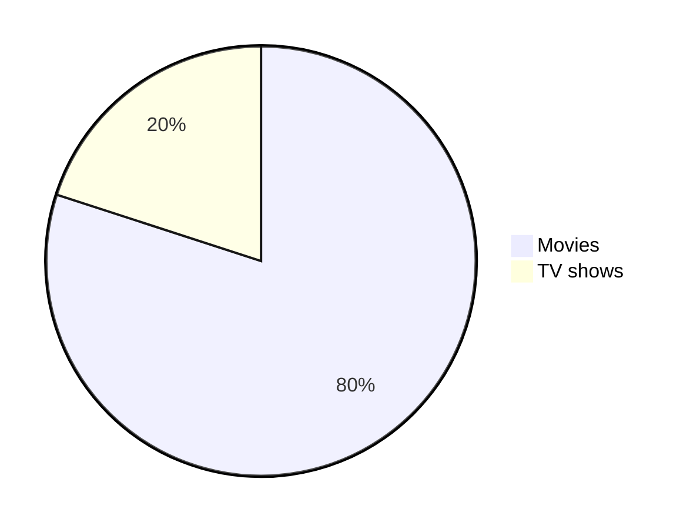

> **Disclaimer**: This is not legal advice, I'm not a legal professional, this information is just my opinion and my interpretation of research I have done. Some of it may not be accurate or may be plain wrong. Use this information at your own risk. I am not responsible for any damages to you, your computer, etc.

> [!NOTE]
> Essential details that users should not overlook, even when browsing quickly.

> [!TIP]
> Additional advice to aid users in achieving better outcomes.

> [!IMPORTANT]
> Vital information required for users to attain success.

> [!WARNING]
> Urgent content that requires immediate user focus due to possible risks.

> [!CAUTION]
> Possible negative outcomes resulting from an action.

Table of contents:

* TOC
{:toc}

 ----
## Formatting

```markdown
Emphasis, aka italics, with *asterisks* or _underscores_.
Strong emphasis, aka bold, with **asterisks** or __underscores__.
Combined emphasis with **asterisks and _underscores_**.
Strikethrough uses two tildes. ~~Scratch this.~~
```

Emphasis, aka italics, with *asterisks* or _underscores_.

Strong emphasis, aka bold, with **asterisks** or __underscores__.

Combined emphasis with **asterisks and _underscores_**.

Strikethrough uses two tildes. ~~Scratch this.~~

 ----
## Footnoes

```markdown
Here is a simple footnote[^1].

A footnote can also have multiple lines[^2].  

You can also use words, to fit your writing style more closely[^note].

[^1]: My reference.
[^2]: Every new line should be prefixed with 2 spaces.  
  This allows you to have a footnote with multiple lines.
[^note]:
    Named footnotes will still render with numbers instead of the text but allow easier identification and linking.  
    This footnote also has been made with a different syntax using 4 spaces for new lines.
```
Here is a simple footnote[^1].

A footnote can also have multiple lines[^2].  

You can also use words, to fit your writing style more closely[^note].

[^1]: My reference.
[^2]: Every new line should be prefixed with 2 spaces.  
  This allows you to have a footnote with multiple lines.
[^note]:
    Named footnotes will still render with numbers instead of the text but allow easier identification and linking.  
    This footnote also has been made with a different syntax using 4 spaces for new lines.

----
## Tables

```markdown
Colons can be used to align columns.

| Tables        | Are           | Cool  |
| ------------- |:-------------:| -----:|
| col 3 is      | right-aligned | $1600 |
| col 2 is      | centered      |   $12 |
| zebra stripes | are neat      |    $1 |

There must be at least 3 dashes separating each header cell.
The outer pipes (|) are optional, and you don't need to make the 
raw Markdown line up prettily. You can also use inline Markdown.

Markdown | Less | Pretty
--- | --- | ---
*Still* | `renders` | **nicely**
1 | 2 | 3
```

Colons can be used to align columns.

| Tables        | Are           | Cool  |
| ------------- |:-------------:| -----:|
| col 3 is      | right-aligned | $1600 |
| col 2 is      | centered      |   $12 |
| zebra stripes | are neat      |    $1 |

There must be at least 3 dashes separating each header cell.
The outer pipes (|) are optional, and you don't need to make the 
raw Markdown line up prettily. You can also use inline Markdown.

Markdown | Less | Pretty
--- | --- | ---
*Still* | `renders` | **nicely**
1 | 2 | 3

 ----
## Embadded code in the aritcle

 ```tsql
 SELECT *
 FROM sys.tables
 WHERE [name] = 'SomeTable'
 ```

 ```powershell
1..300 | oh -Paging
1..300 | more
```

 ----
## Diagrams & Charts

```markdown
pie
"Movies" : 80
"TV shows" : 20
```


 ----
## Mathematical expressions (19 July 2022)

```markdown
This is an inline math expression $x = {-b \pm \sqrt{b^2-4ac} \over 2a}$
```

This is an inline math expression $x = {-b \pm \sqrt{b^2-4ac} \over 2a}$

```markdown
x = {-b \pm \sqrt{b^2-4ac} \over 2a}
```

$$
x = {-b \pm \sqrt{b^2-4ac} \over 2a}
$$

----
## Embadded youtube vidoes

```markdown
[](http://www.youtube.com/watch?v=YOUTUBE_VIDEO_ID_HERE)
```

[](https://www.youtube.com/watch?v=DkGV5F4XnfQ)

<iframe width="293" height="71" src="https://www.youtube.com/embed/DkGV5F4XnfQ" title="Learn Vite with Evan You" frameborder="0" allow="accelerometer; autoplay; clipboard-write; encrypted-media; gyroscope; picture-in-picture; web-share" referrerpolicy="strict-origin-when-cross-origin" allowfullscreen></iframe>
 ----
## Final thoughts

There are still a lot of tips and tricks on markdowns to learn out there. 

[Back to top](#top)

[:arrow_up:](#top)
